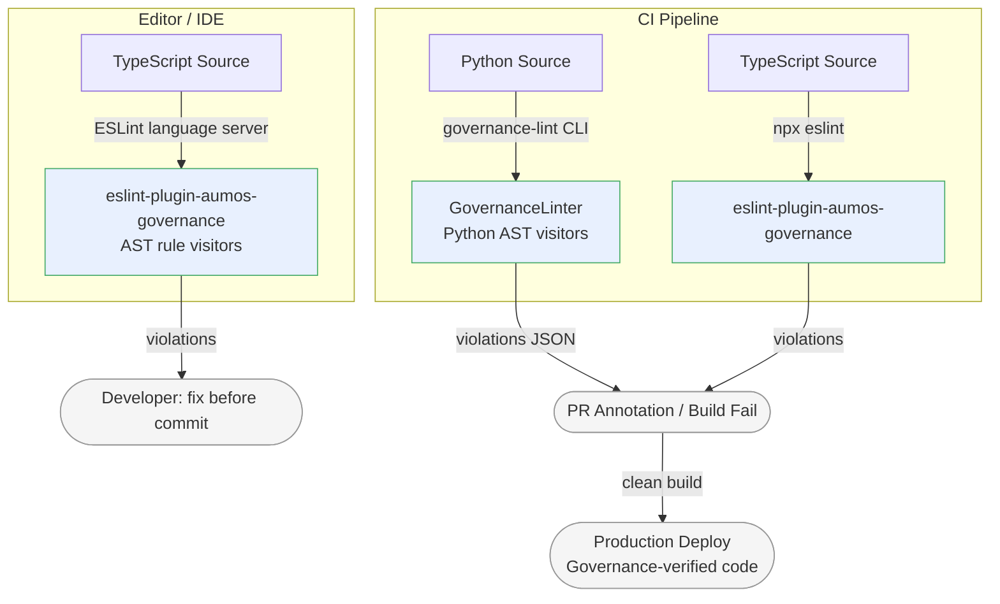

# governance-linter

[](https://github.com/aumos-ai/governance-linter)
[](https://www.npmjs.com/package/eslint-plugin-aumos-governance)
[](https://pypi.org/project/aumos-governance-linter/)
[](LICENSE)

Static analysis catching ungoverned agent actions. Part of the [AumOS](https://github.com/aumos-ai) open-source governance suite.

---

## Why Does This Exist?

Governance policies written in agents.md files and SDK configurations only protect you at runtime — when your agent is already running in production, making real decisions, touching real data, spending real money. If a developer forgets to add a consent check before a data-access call, or uses a magic number instead of a named trust constant, that mistake lives silently in the codebase until it either fires in production or an auditor finds it.

The problem is that governance is hard to see. It is not a function that returns a value; it is a *preceding call* that must happen before another call. Traditional code review catches logic errors, but reviewers rarely notice that a `tool.run()` call on line 47 has no `engine.check()` anywhere in the preceding lines. The gap is invisible until something goes wrong.

Static analysis makes the invisible visible. The same way a spell-checker catches typos before a document is published, governance-linter catches policy gaps before code reaches a production agent runtime. It runs in your editor, in pre-commit hooks, and in CI — anywhere you can run ESLint or a Python CLI.

**The spell-checker analogy:** A governance policy gap is not a runtime crash; it is a silent omission — like a missing word that changes the meaning of a sentence. You need a tool that reads the code the way an auditor would, not just the way a compiler would. governance-linter is that tool.

**Without this tool:** Policy violations reach production silently. An audit finds that 12 tool calls across 4 agent services have no governance check. Remediation is expensive and disruptive. With governance-linter in CI, violations are caught at the pull request stage, before they are ever deployed.

---

## Who Is This For?

| Audience | Use Case |
|---|---|
| **Developer** | Catch governance mistakes in your editor or pre-commit hook before they reach code review |
| **Enterprise** | Enforce a governance baseline in CI across every agent service — auditable, automatable, fast |
| **Both** | Write custom rules to encode organisation-specific governance patterns that no generic linter ships |

---

## Overview

Ships as two complementary tools:

| Tool | Language | Package |
|------|----------|---------|
| ESLint plugin | TypeScript / JavaScript | `eslint-plugin-aumos-governance` |
| AST-based linter + CLI | Python | `aumos-governance-linter` |

Both tools enforce the same five governance rules at development time so that policy gaps are caught in code review and CI — long before they reach a production agent runtime.

---

## Rules

| Rule | Default | Description |
|------|---------|-------------|
| `no-ungoverned-tool-call` | `error` | Tool invocations require a prior governance check |
| `no-unlogged-action` | `warn` | Governance decisions must be passed to an audit logger |
| `no-hardcoded-trust-level` | `warn` | Trust-level comparisons must use named constants, not magic numbers |
| `require-consent-check` | `warn` | Data-access calls require a prior consent check |
| `require-budget-check` | `warn` | LLM / API spend calls require a prior budget check |

Full rule documentation: [docs/rules.md](docs/rules.md)

---

## Quick Start

### TypeScript (ESLint)

**Prerequisites:** Node.js >= 20, ESLint >= 9

```bash
npm install --save-dev eslint-plugin-aumos-governance eslint
```

```javascript
// eslint.config.js
import aumos from 'eslint-plugin-aumos-governance';

export default [
  aumos.configs.recommended,
];
```

```bash
npx eslint "src/**/*.ts"
# src/agent.ts
#   12:5  error  Tool invocation at line 12 has no preceding governance check  aumos-governance/no-ungoverned-tool-call
#   27:3  warn   LLM call at line 27 has no preceding budget check             aumos-governance/require-budget-check
# 2 problems (1 error, 1 warning)
```

**What just happened?** ESLint traversed your TypeScript AST looking for tool invocations and LLM calls that have no preceding `engine.check()` or `budget.check()` call. Problems print inline in your editor and fail CI just like a TypeScript type error.

### Python

**Prerequisites:** Python >= 3.10

```bash
pip install aumos-governance-linter
governance-lint src/
# src/agent.py:34  [no-ungoverned-tool-call]  tool.run() called without prior engine.check()
# src/tools.py:61  [require-consent-check]    data_store.read() called without prior consent.check()
# 2 violation(s) found
```

**What just happened?** The CLI walked your source tree, parsed each Python file with the standard `ast` module, and applied governance rules as AST visitors. The output lists file, line, rule name, and a plain-English explanation — machine-readable with `--format json` for CI annotation.

---

## Installation

### TypeScript

Requires Node.js >= 20 and ESLint >= 9.

```bash
npm install --save-dev eslint-plugin-aumos-governance
# or
pnpm add -D eslint-plugin-aumos-governance
```

### Python

Requires Python >= 3.10.

```bash
pip install aumos-governance-linter
```

---

## Usage

### TypeScript — Recommended Config

```javascript
// eslint.config.js
import aumos from 'eslint-plugin-aumos-governance';

export default [
  aumos.configs.recommended,
];
```

### TypeScript — Per-Rule Config

```javascript
import aumos from 'eslint-plugin-aumos-governance';

export default [
  {
    plugins: { 'aumos-governance': aumos },
    rules: {
      'aumos-governance/no-ungoverned-tool-call': 'error',
      'aumos-governance/no-unlogged-action': 'warn',
      'aumos-governance/no-hardcoded-trust-level': 'warn',
      'aumos-governance/require-consent-check': 'warn',
      'aumos-governance/require-budget-check': 'warn',
    },
  },
];
```

### Python CLI

```bash
# Lint a directory tree
governance-lint src/

# Lint individual files
governance-lint src/agent.py src/tools.py

# Enable only specific rules
governance-lint src/ --rules no-ungoverned-tool-call require-budget-check

# Output JSON for tooling integration
governance-lint src/ --format json
```

### Python — Programmatic API

```python
from governance_linter import GovernanceLinter

linter = GovernanceLinter()
violations = linter.lint_file("src/agent.py")
print(linter.format_violations(violations))
```

---

## Example Violations

### no-ungoverned-tool-call

```python
# Violation — no governance check before tool.run()
async def handle_request(request: AgentRequest) -> AgentResponse:
    result = await tool.run(request.action)   # [no-ungoverned-tool-call]
    return AgentResponse(result=result)

# Fixed
async def handle_request(request: AgentRequest) -> AgentResponse:
    await engine.check("run-action", {"action": request.action})
    result = await tool.run(request.action)   # OK
    return AgentResponse(result=result)
```

### no-hardcoded-trust-level

```typescript
// Violation — magic number 3
if (agent.trustLevel >= 3) { ... }  // [no-hardcoded-trust-level]

// Fixed
import { TrustLevel } from '@aumos/core';
if (agent.trustLevel >= TrustLevel.OPERATOR) { ... }  // OK
```

### require-budget-check

```typescript
// Violation — LLM call without budget check
async function summarise(text: string) {
  return await openai.chat({ ... });  // [require-budget-check]
}

// Fixed
async function summarise(text: string) {
  await budget.check({ operation: "summarise", estimatedTokens: 300 });
  return await openai.chat({ ... });  // OK
}
```

---

## Architecture



### How Rules Work

Each rule is an AST visitor. For every function body it encounters:
1. It collects all call expressions that match a governed pattern (e.g., calls to `tool.run`, `openai.chat`, `data_store.read`).
2. It scans preceding statements in the same scope for a matching prerequisite call (e.g., `engine.check`, `budget.check`, `consent.check`).
3. If the prerequisite is absent, it reports a violation with file path, line number, rule name, and explanation.

Custom rules follow the same visitor interface — see [docs/rules.md](docs/rules.md) for the authoring guide.

---

## CI Integration

See [docs/ci-integration.md](docs/ci-integration.md) for:

- GitHub Actions workflows
- Pre-commit hook configuration
- PR annotation with JSON output
- Suppression comments for false positives

---

## Development

### TypeScript

```bash
cd typescript
npm install
npm run build      # compile with tsup
npm run typecheck  # tsc --noEmit
```

### Python

```bash
cd python
pip install -e ".[dev]"
governance-lint src/           # self-lint
ruff check src/                # style lint
mypy src/                      # type check
```

---

## Related Projects

| Project | Relationship |
|---|---|
| [aumos-core](https://github.com/aumos-ai/aumos-core) | Runtime enforcement — governance-linter catches gaps at dev time, aumos-core enforces the same policies at runtime |
| [agent-shadow-mode](https://github.com/aumos-ai/agent-shadow-mode) | Behavioural evaluation — governance-linter checks code structure; shadow mode observes runtime decisions |
| [mcp-server-trust-gate](https://github.com/aumos-ai/mcp-server-trust-gate) | MCP runtime gate — linter ensures SDK usage is correct before the gate ever executes |
| [agents-md-spec](https://github.com/aumos-ai/agents-md-spec) | The agents.md specification that governance-linter rules are built to enforce |

---

## Contributing

See [CONTRIBUTING.md](CONTRIBUTING.md) for guidance on adding new rules, commit style, and the PR process.

## Fire Line

See [FIRE_LINE.md](FIRE_LINE.md) for hard boundaries on what this tool does and does not do.

## License

Apache 2.0 — see [LICENSE](LICENSE).

Copyright (c) 2026 MuVeraAI Corporation
